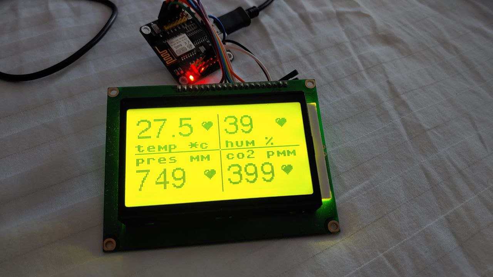

# micropython-lcd12864 (st7920)
Framebuffer display driver for LiquidCrystal LCD12864 (SPI)



**LCD12864 connect using SPI**

|LCD12864|ESP8266|ESP32|Notes|
| ------ | ------ |------ | ----- |
|GND|GND|GND|  |
|VCC|+5V|+5V| or VIN |
|V0|-|-|-|
|RS|GPIO15(D6)|GPIO15|SPI: CS, CS_PIN|
|R/W|GPIO13(D7)| GPIO13 |SPI: MOSI|
|E|GPIO14(D5)| GPIO14 |SPI: SCK|
|DB0|-|-|-|
|..|-|-|-|
|DB7|-|-|-|
|PSB|GND|GND|or LOW state|
|NC|-|-|-|
|RST|GPIO4(D2)|GPIO4|RST_PIN or +3.3v|
|VOUT|-|-|-|
|BLA|+3.3 or +5v|+3.3 or +5v|Backlight+|
|BLK|GND|GND|Backlight-|

Code example:

```python
from machine import SPI
from lcd12864_spi import LCD12864_SPI

spi = SPI( 1, baudrate = 1_000_000, polarity = 1, phase = 1 )
lcd = LCD12864_SPI( spi = spi, cs_pin = 15, rst_pin = 4, rotation = 1 )

lcd.text( "MicroPython !", 10, 25, 1 )
lcd.rect( 0, 0, 128, 64, 1 )
lcd.rect( 3, 3, 128-6, 64-6, 1 )
lcd.show()
```
## Display functions:
* **clear( self ):** - Clear display
* **set_font(self, font):** - Set font for text
* **set_text_wrap(self, on = True):** - Set text wrapping
* **draw_text(self, text, x, y, color = 1):** - Draw text on display
* **draw_bitmap(self, bitmap, x, y, color = 1):** - Draw a bitmap on display
* **show( self ):** - Send frameBuffer to lcd
* **other framebuffer functions** - see more on https://docs.micropython.org/en/latest/library/framebuf.html#module-framebuf

## Tools
* **tools/font_to_py.py** - Used to convert ttf font to py-script. First of all, you need to install: `pip install freetype-py`. Then run a command similar to the example: `python font_to_py.py -x LibreBodoni-Bold.ttf 24 LibreBodoni24.py`. More details: https://github.com/peterhinch/micropython-font-to-py


