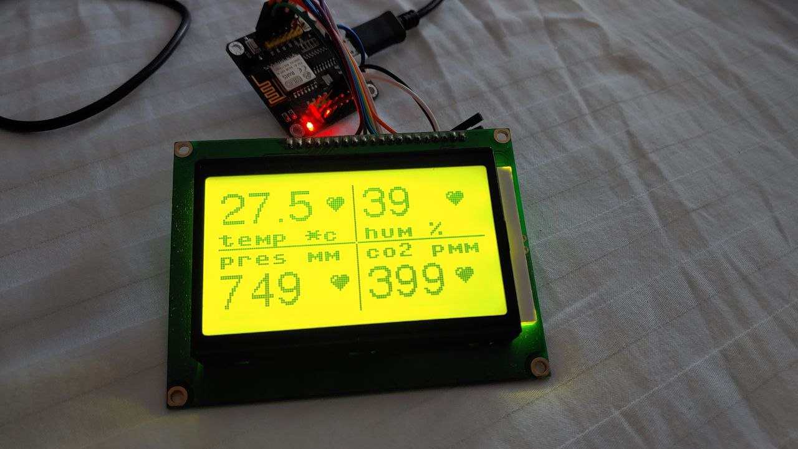

# micropython-lcd12864 (st7920)



**LCD12864 connect using SPI**

|LCD12864|ESP8266|Notes|
| ------ | ------ | ----- |
|GND|GND|  |
|VCC|+5V|  |
|V0|-|  |
|RS|GPIO15(D8)| SPI CS |
|R/W|GPIO13(D7)| SPI Mosi |
|E|GPIO14(D5)| SPI Sck |
|DB0|-|  |
|..|-|  | 
|DB7|-|  |
|PSB|GND|  |
|NC|-|  |
|RST|+5V|  |
|VOUT|-|  |
|BLA|+3.3V| or 5v |
|BLK|GND|  |

Code example:

```python
from machine import SPI, Pin
from lcd12864 import SPI_LCD12864

spi = machine.SPI(1, baudrate=100000, polarity=1, phase=1)
cs = Pin( 15, Pin.OUT, value=0 )

lcd = SPI_LCD12864( spi=spi, cs=cs )
lcd.text( "MicroPython !", 10, 25, 1 )
lcd.rect(0,0,128,64,1)
lcd.rect(3,3,128-6,64-6,1)
lcd.update()
```
This project is a updated version of project from: https://github.com/mchobby/esp8266-upy/tree/master/lcdspi-lcd12864

Additions:
* vertical rotaion
* fast graphic render
* no blink in display

All dependencies are used only in examples. To reduce resource consumption, I sometimes use compiled libraries with .mpy extention (This mpy version-5 work fine with Micropython v1.12-1.18). But you can take normal library: with .py, or compile your own. See: https://docs.micropython.org/en/latest/reference/mpyfiles.html

The "test_meteo.py" example for a big fonts uses the "Writer" class. See: https://github.com/peterhinch/micropython-font-to-py/blob/master/writer/WRITER.md
